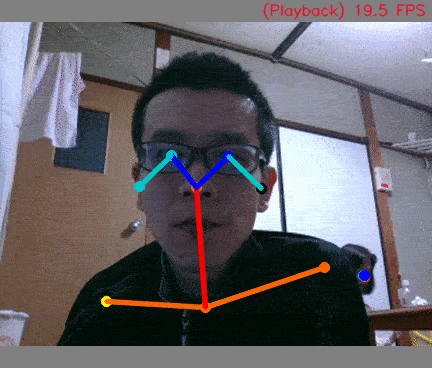
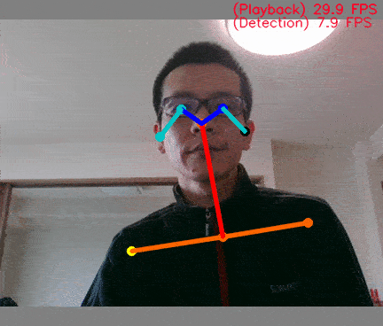
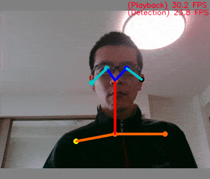

# MobileNetV2-PoseEstimation
**[Caution] The behavior of RraspberryPi+NCS2 is very unstable.**  
**[Caution] The behavior of Tensorflow Lite+CPU is unstable.**  
**[Caution] May 06, 2019, The Google Edge TPU program and model are under construction.**  
**[Info] Jun 08, 2020, I'm tuning the performance of the Tensorflow Lite model significantly. https://github.com/PINTO0309/PINTO_model_zoo/tree/master/007_mobilenetv2-poseestimation**  


## Introduction
This repository has its own implementation, impressed by ildoonet's achievements.  
Thank you, **[ildoonet](https://github.com/ildoonet)**.  
**https://github.com/ildoonet/tf-pose-estimation.git**  
  
I will make his implementation even faster with CPU only.  

## Environment
- Ubuntu 16.04 x86_64
- **[OpenVINO 2019 R1.0.1](https://github.com/PINTO0309/OpenVINO-bin.git)**
- **[Tensorflow v1.12.0 + Tensorflow Lite](https://github.com/PINTO0309/Tensorflow-bin.git)**
- USB Camera
- Neural Compute Stick 2 (NCS2)
- Google Edge TPU
- Python 3.5

## Environment construction and training procedure
**[Learn "Openpose" from scratch with MobileNetv2 + MS-COCO and deploy it to OpenVINO/TensorflowLite Part.1](https://qiita.com/PINTO/items/2316882e18715c6f138c)**  
  
**[Learn "Openpose" from scratch with MobileNetv2 + MS-COCO and deploy it to OpenVINO/TensorflowLite (Inference by OpenVINO/NCS2) Part.2](https://qiita.com/PINTO/items/c1889317bc16534a75cf)**

## Core i7 only + OpenVINO + Openpose Large model + Sync mode (disabled GPU)
  
## NCS2 x1 + OpenVINO + Openpose Large model + Async + Normal mode
  
## Core i7 only + OpenVINO + Openpose Small model + Sync + Boost mode (disabled GPU)
  
## NCS2 x1 + OpenVINO + Openpose Small model + Async + Boost mode
  

## Usage
```console
$ git clone https://github.com/PINTO0309/MobileNetV2-PoseEstimation.git
$ cd MobileNetV2-PoseEstimation
```
**CPU - Sync Mode**  
```console
$ python3 openvino-usbcamera-cpu-ncs2-sync.py -d CPU
```
**CPU - Sync + Boost Mode**  
```console
$ python3 openvino-usbcamera-cpu-ncs2-sync.py -d CPU -b True
```
**NCS2 - Sync Mode**  
```console
$ python3 openvino-usbcamera-cpu-ncs2-sync.py -d MYRIAD
```
  
**CPU - Async Mode**  
```console
$ python3 openvino-usbcamera-cpu-ncs2-async.py -d CPU
```
**NCS2 - Async - Single Stick Mode**  
```console
$ python3 openvino-usbcamera-cpu-ncs2-async.py -d MYRIAD
```
**NCS2 - Async - Multi Stick Mode**  
```console
$ python3 openvino-usbcamera-cpu-ncs2-async.py -d MYRIAD -numncs 2
```
**NCS2 - Async - Single Stick + Boost Mode**  
```console
$ python3 openvino-usbcamera-cpu-ncs2-async.py -d MYRIAD -b True
```
**GPU (Intel HD series only) - Async - Boost Mode**  
```console
$ python3 openvino-usbcamera-cpu-ncs2-async.py -d GPU -b True
```
## Reference articles, Very Thanks!!
**https://github.com/ildoonet/tf-pose-estimation.git**  
**https://www.tensorflow.org/api_docs/python/tf/image/resize_area**  
**[Python OpenCVの基礎 resieで画像サイズを変えてみる - Pythonの学習の過程とか - ピーハイ](http://peaceandhilightandpython.hatenablog.com/entry/2016/01/09/214333)**  
**[Blurring and Smoothing - OpenCV with Python for Image and Video Analysis 8](https://youtu.be/sARklx6sgDk?t=228)**  
**https://www.learnopencv.com/deep-learning-based-human-pose-estimation-using-opencv-cpp-python/**  
**https://teratail.com/questions/169393**  
